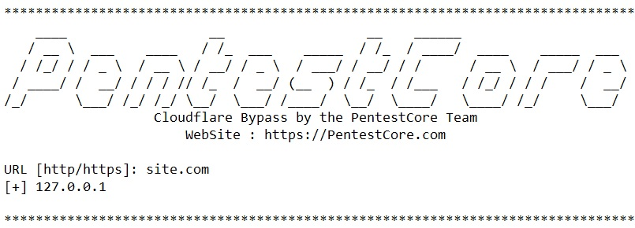

# Cloudflare-Bypass
Cloudflare Bypass tools | PentestCore
Is a tool for bypassing Cloudflare that you can use to get the master IP of site server.
<h2>Installation</h2>
<h3>Linux :</h3>
 Enter the below command in the terminal :
<code> git clone https://github.com/pentestcore/Cloudflare-Bypass.git
 cd Cloudflare-Bypass
</code>
 Install php :
<code> apt-get install php</code>
  Run :
<code> php Cloudflare-Bypass.php</code>
 Enter website URL.

<h3>Windows :</h3>
 Enter the below command in the CMD :
 php.exe Cloudflare-Bypass.php
 Enter website URL.

 Website : https://pentestcore.com/
 PentestCore Team
